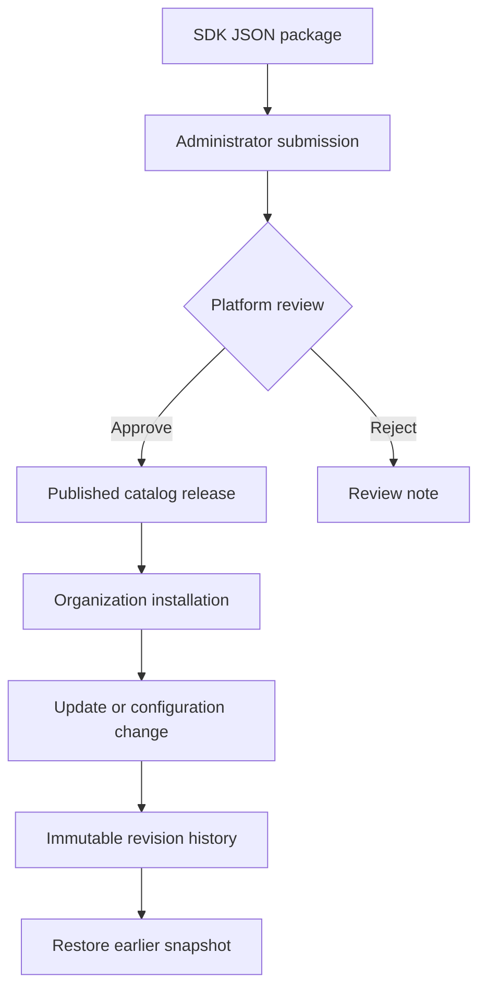

# Plugin marketplace and developer SDK

## What is included

StockPilot now has a searchable marketplace of bundled and reviewed community releases.
Administrators submit JSON packages, a platform reviewer approves/rejects them, and
organizations install or update approved versions. The existing Plugins page continues
to manage configuration, enable/disable, immutable history and rollback.

Plugin API 1 supports two read-only hooks: `inventory.low_stock` and `dashboard.notice`.
These add-ons configure existing StockPilot capabilities. This is not an executable
WordPress-style plugin engine: there is no uploaded Python/JavaScript, arbitrary UI code,
payment checkout, remote package installer or third-party marketplace connection.

## Lifecycle and permissions



- An active organization membership is required to browse.
- Organization administrators can submit and manage their organization's installations.
- Review requires both an administrator membership and Django `is_staff=True`.
  A trusted platform operator assigns staff status; the marketplace never grants it.
- Pending submissions are private to their publisher organization and platform reviewers.
- Approved manifests and their descriptions are visible to all authenticated organizations.
- A plugin ID belongs to its first publisher organization. Bundled IDs are reserved.
- A `(slug, version)` is immutable through the API. Corrections require a new version.
- Review is a terminal decision for that submission. Rejected submissions are not installable.
- SHA-256 checks detect inconsistent stored manifests; they are integrity checks, not author signatures.
- Server validation checks versions, core compatibility, hooks, settings and dependencies.
- Installation commands keep the existing atomic transactions, optimistic revisions and
  idempotency keys. Rollback restores plugin state; it never reverses ERP transactions.

## SDK: install locally

An SDK is a software development kit: reusable validation, a client and commands for
developers. It helps build an add-on; it is not itself an installed organization add-on.
This SDK is included in the ZIP and is not published to PyPI.

From the project root, with Python 3.10+:

```bash
python -m venv .sdk-venv
# Linux/macOS:
source .sdk-venv/bin/activate
# Windows PowerShell instead: .sdk-venv\Scripts\Activate.ps1
python -m pip install ./sdk/python
stockpilot-plugin init my-stock-alert
stockpilot-plugin validate manifest.json
stockpilot-plugin build manifest.json --summary "Low-stock alert for our warehouses"
```

The commands create `manifest.json` and `plugin.json`, refusing to overwrite existing files.
Change the name, version and threshold in the manifest, then validate/build again using
another output path (`--output plugin-v2.json`). Keep IDs stable when publishing updates.
`sdk/example-plugin.json` is a complete package ready to paste into the submission form.

## Publish and use an add-on

1. Log in as an organization administrator. Open **Marketplace**.
2. Paste `plugin.json` into **Package JSON** and submit it for review.
3. A trusted platform reviewer opens Marketplace, inspects the manifest, supplies a review
   note and approves or rejects it. Their staff permission can expose other publishers'
   pending manifests, so do not give it to ordinary tenant administrators.
4. After approval, the release appears in the catalog. Search/filter and select **Install**.
5. Open **Plugins**, choose its ID and configure it. Inspect the output and history.
6. Submit a higher version under the same publisher organization. After approval,
   **Update** becomes available. Use **Plugins → Rollback** to restore an earlier revision.

Optional CLI submission (token stays in an environment variable):

```bash
# Set STOCKPILOT_TOKEN to your short-lived access token using your shell.
stockpilot-plugin submit manifest.json --summary "Low-stock alert" \
  --base-url http://localhost:3000/api/v1 --organization YOUR_ORGANIZATION_UUID
```

For direct local Django authentication, use `http://localhost:8000/api/v1` instead.
Use HTTPS outside localhost. The client does not follow redirects or automatically retry
writes. Keep the same `idempotency_key` when retrying the same `Client.command(...)` after a timeout.
The Python `Client` provides `catalog`, `submit` and `command` methods.

## Code map

| Part | File | Purpose |
|---|---|---|
| Manifest contract | `services/erp-core/apps/extensions/registry.py` | Validate bundled and approved releases |
| Publishing API | `extensions/marketplace.py` | Ownership, submission and platform review |
| Installation engine | `extensions/services.py` | Install/update/enable/configure/rollback |
| Read-only hooks | `extensions/hooks.py` | Execute the two approved behaviors with tenant filtering |
| Tables | `extensions/models.py` | Releases, installations, revisions and design settings |
| Marketplace screen | `apps/web/src/features/plugins/MarketplacePage.tsx` | Search, submit, review and install |
| Existing lifecycle screen | `features/plugins/PluginsPage.tsx` | Configuration, output and history |
| SDK client/CLI | `sdk/python/stockpilot_sdk.py` | Developer commands and authenticated API requests |
| SDK validation | `sdk/python/stockpilot_validation.py` | Standalone copy of API 1 contract, guarded by parity tests |

Adding a third hook still requires a reviewed core-code change, implementation, permission
design and tests. A manifest cannot introduce new executable behavior on its own.
